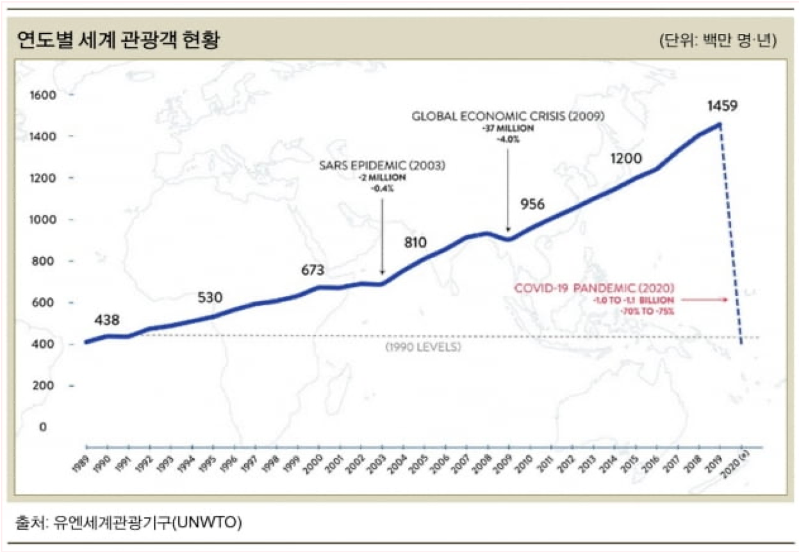
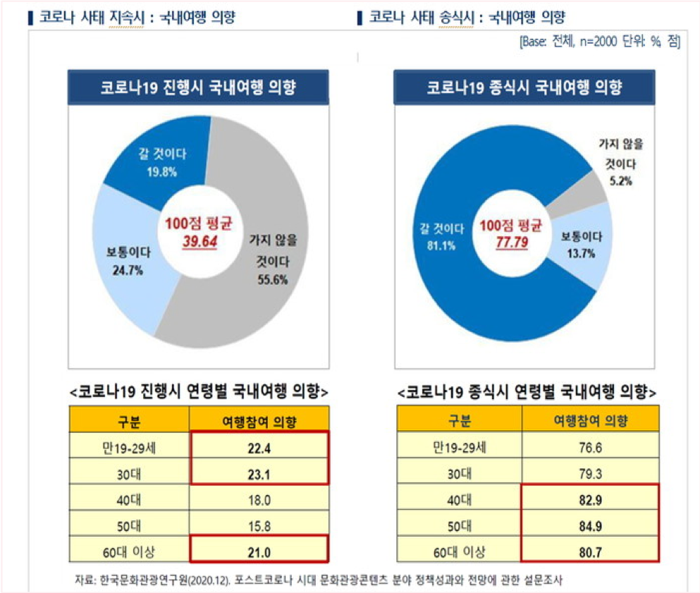
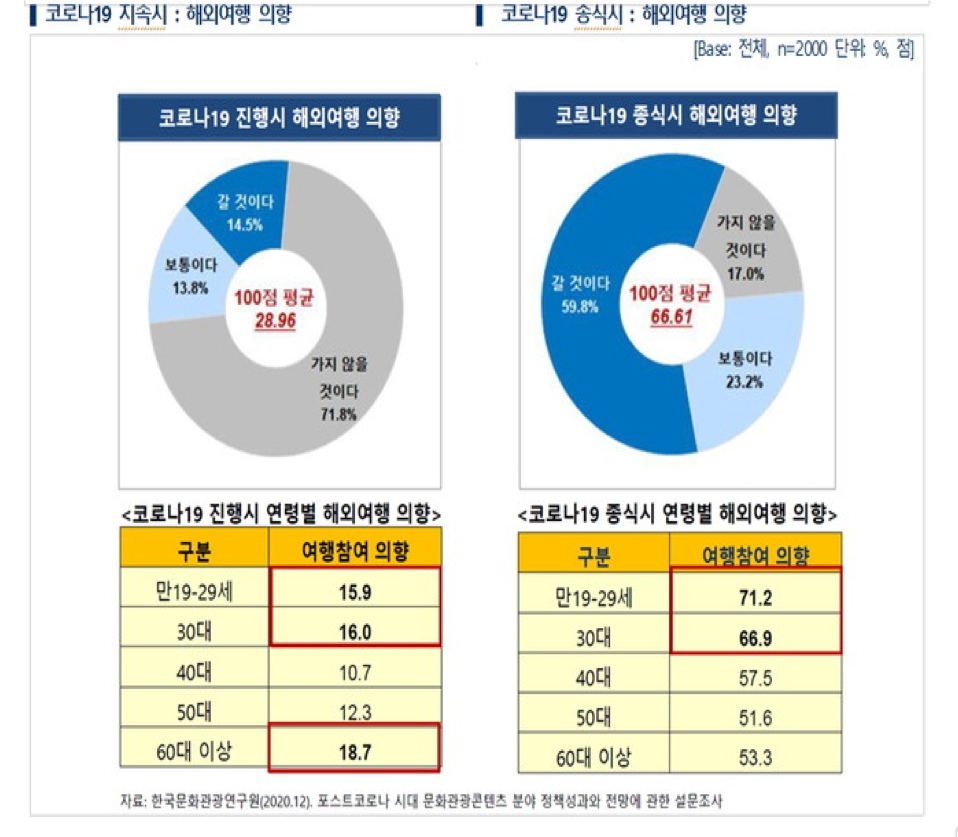

# 호텔 예약여부 예측모델 제작 및 전략분석

### 개요

- 관광산업은 코로나 사태 이전까지 쭉 성장하고 있었던 추세.
- 2020년 코로나 사태의 영향으로 대폭 감소한 것을 볼 수 있음. 

- 설문조사 자료를 보면 코로나 상황이 지속될 시 여행을 희망하지 않고, 종식 시 여행을 강력히 희망하고 있음.
- 따라서 관광사업 관련 데이터를 분석하여 필요한 전략을 구축하는 것이 중요.

- 사용한 데이터 : kaggle의 hotel booking demand 데이터셋을 활용. (https://www.kaggle.com/jessemostipak/hotel-booking-demand)
  - 데이터 설명: 호텔 예약 수요에 관련된 특성이 들어있으며, is_canceled column을 타겟으로 예측모델 모델링이나 데이터분석이 가능.
  - 사용 모델: 분류모델 중 XGBoost 사용.(https://xgboost.readthedocs.io/en/stable/)
---
### 결론
- 포스트 코로나 시기 관광산업 대한 소비욕구가 상승할 것으로 예상.
- 호텔 예약 취소율을 줄이려면 호텔의 시설, 예약 처리의 정확성, 고객의 요구사항 중점적으로 관리 및 전체적인 개편
- 공실을 유지하는 것보다는 이벤트를 통해 공실을 줄이는 것도 하나의 전략
- 고객들이 생각하는 적정가격은 80달러 초반으로 보여짐.

---
### 발표자료
- Colab Notebook : https://github.com/phdo94/AI_section1_project2/blob/master/AI_02%EA%B8%B0_%EB%B0%95%ED%97%8C%EB%8F%84_Section2.ipynb
- pptx : https://github.com/phdo94/AI_section1_project2/blob/master/AI_02%EA%B8%B0_%EB%B0%95%ED%97%8C%EB%8F%84_Section2.pptx
- 발표영상 : https://github.com/phdo94/AI_section1_project2/blob/master/AI_02%EA%B8%B0_%EB%B0%95%ED%97%8C%EB%8F%84_Section2.mp4
